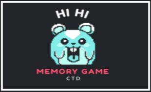
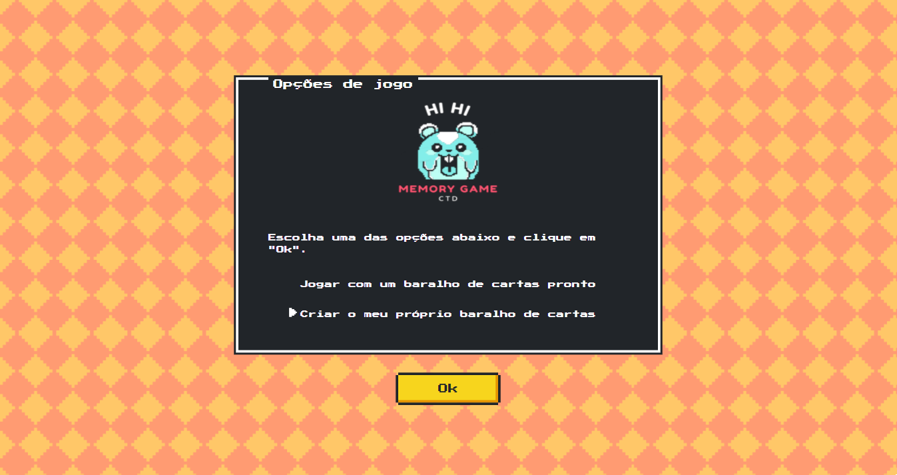
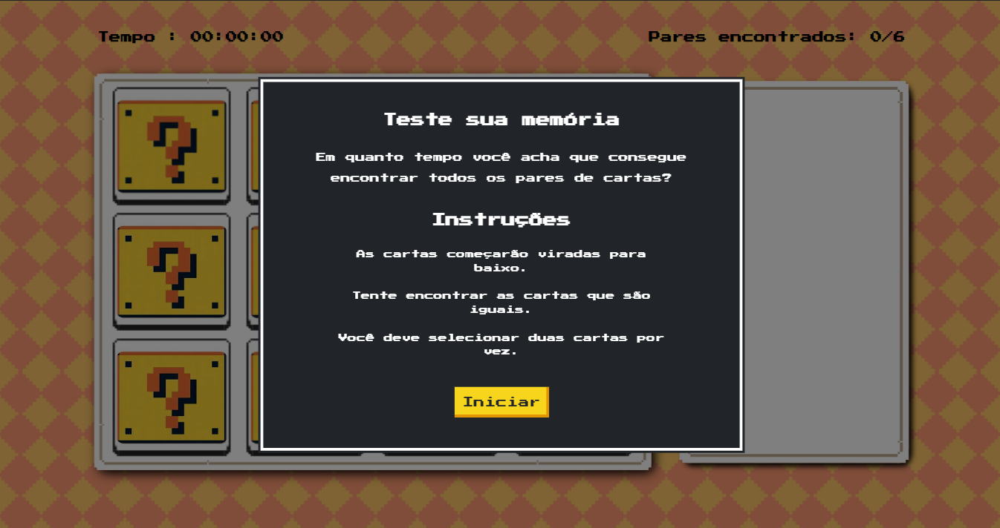

<h1 align="center">
    
     
     
    Memory Game - Certified Tech Developer
</h1>
 

### Este projeto foi desenvolvido para a matéria de Front-End II, do curso <a id='ctd' href="https://assets.digitalhouse.com/content/br/course/certified-tech-developer.pdf">Certified Tech Developer</a>, da Digital House em parceria com o Mercado Livre e a empresa Globant.

### O desafio era desenvolver uma página web, com tema livre, porém observando-se algumas regras:

* A aplicação deveria ser responsiva.

* A aplicação deveria conter um formulário que, ao ser preenchido, criasse cards com as informações preenchidas.

* O formulário deveria ter pelo menos 4 campos: Título, Descrição e URL da imagem e um botão de submit.

> Foram desenvolvidas quatro páginas neste projeto. Para a página do formulário, nos desafiamos a desenvolvê-la inteiramente em Javascript puro.

</h4>

  <a href="#Technologies">Technologias</a>&nbsp;&nbsp;&nbsp;|&nbsp;&nbsp;&nbsp;
  <a href="#developers">Desenvolvedores</a>

 

<!--  -->

## Tecnologias
 

  <code>
    
  </code>
  <code>
    
  </code>
  <code>
    
  </code>
  <code>
    
  </code>

     
     

## Desenvolvedores
 
<table>
  <tr>
     <td>
        <a href="https://github.com/marcelonader" target="_blank">
          
           
          
            <b>Marcelo Nader</b>
          
        </a>
     </td>
          <td>
        <a href="https://github.com/marcelomsz" target="_blank">
          
           
          
            <b>Marcelo Miyoshi</b>
          
        </a>
     </td>
          <td>
        <a href="https://github.com/monique36" target="_blank">
          
           
          
            <b>Monique Mendes</b>
          
        </a>
     </td>
     <td>
        <a href="https://github.com/pedroisb" target="_blank">
          
           
          
            <b>Pedro Brito</b>
          
        </a>
     </td>
  </tr>
</table>

---

